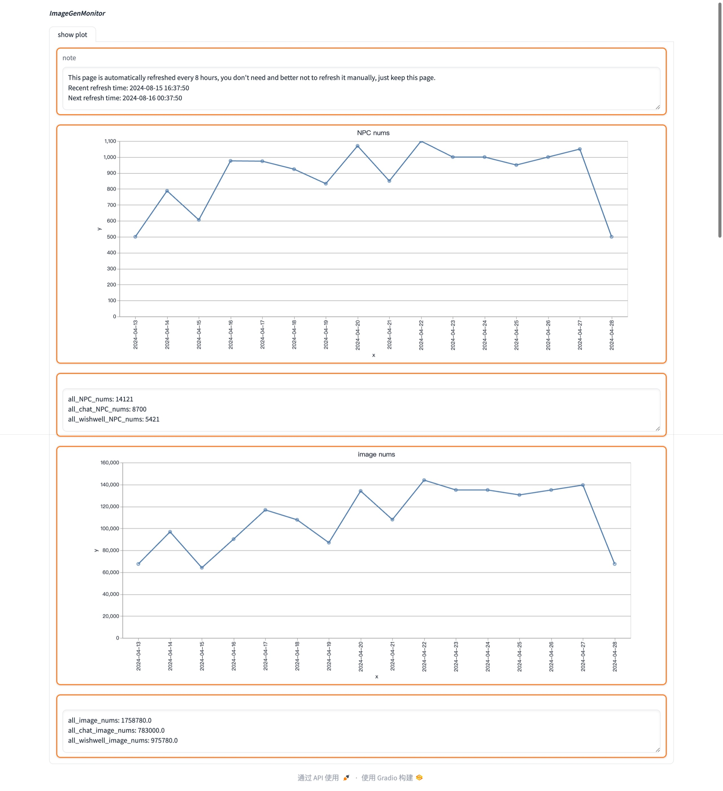

# ImageGenMonitor
ImageGenMonitor is an image generation monitoring platform to refresh periodically to view how many automatic offline images were being generated.
## Run
```
python app.py
```
## Result presentation

